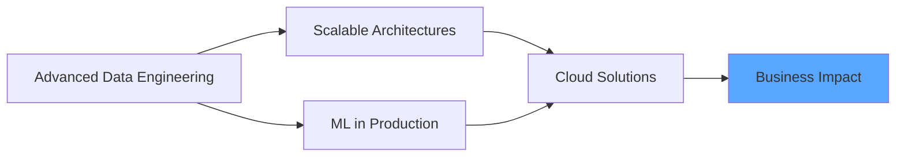
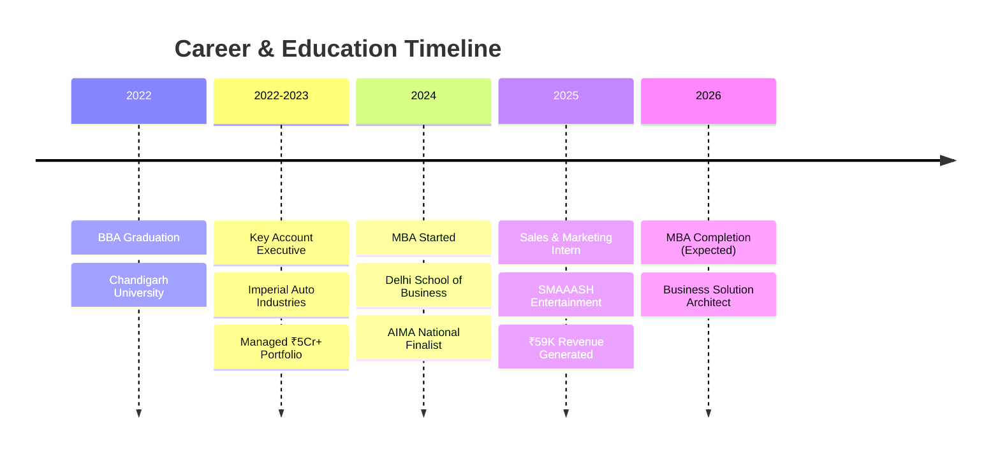

<div align="center">

# Hey there! 👋 I'm Devansh Khanna

### Business Solution Architect | Vibe Coder | Data-Driven Decision Maker


> *I don't just write code — I architect business solutions. Where MBAs meet APIs, and Excel meets XGBoost.*

[](https://www.linkedin.com/in/devansh-khanna-618606178/)
[](https://devisdev365.github.io/devansh-portfolio/)
[](mailto:devansh.khanna24@dsb.edu.in)


</div>

---

## 📊 Impact Dashboard

<div align="center">

<table>
<tr>
<td align="center" width="25%">

<br><strong>₹5+ Crore</strong>
<br><sub>Revenue Managed</sub>
</td>
<td align="center" width="25%">

<br><strong>87% Faster</strong>
<br><sub>Workflow Automation</sub>
</td>
<td align="center" width="25%">

<br><strong>12% Improvement</strong>
<br><sub>Pricing Accuracy</sub>
</td>
<td align="center" width="25%">

<br><strong>Top 20 Nationally</strong>
<br><sub>1,200+ Teams</sub>
</td>
</tr>
</table>

</div>

---

## 🎯 What I Do

I'm that rare breed who speaks both **boardroom** and **backend**. Currently pursuing my MBA at Delhi School of Business while building technical solutions that actually solve real business problems.

**Not a developer, but a business solution architect** who codes when it solves a problem. I bridge the gap between "what the business needs" and "what tech can deliver."

**My Superpower?** Translating "We need better insights" into production-ready dashboards, and "This takes too long" into automated workflows that save 87% of manual effort.

### The Tech-Business Bridge
- 📊 **Business Side:** Managed ₹5Cr+ portfolio, led cross-functional teams, drove go-to-market strategies
- 💻 **Tech Side:** Python automation, API integrations, ML models, cloud backends
- 🚀 **The Magic:** Combining both to build solutions that actually get used (and loved) by business teams

---

## 🛠️ My Toolkit (Business Solutions Edition)

<details open>
<summary><b>🔥 Click to expand my tech arsenal</b></summary>
<br>

**Languages & Frameworks**


**Data & Analytics**


**AI & Machine Learning**


**Cloud & Backend**


### 💪 Skill Proficiency

```text
Business Strategy     ████████████████████   100%
Data Analytics        ███████████████████░    95%
Python Automation     ██████████████████░░    90%
Excel/VBA             ██████████████████░░    90%
SQL & Databases       █████████████████░░░    85%
Power BI Dashboards   █████████████████░░░    85%
API Integration       ████████████████░░░░    80%
Machine Learning      ███████████████░░░░░    75%
Cloud Architecture    ██████████████░░░░░░    70%
```

</details>

---

## 💼 Real-World Impact

<table>
<tr>
<td width="50%" valign="top">

### 🏭 Imperial Auto Industries
**Key Account Executive** | *Aug 2022 - Aug 2023*

```yaml
Portfolio Value: ₹5+ Crore
Accounts Managed: 3 OEMs
Key Achievement: 87% Time Reduction
```

🎯 **Impact Metrics:**
- 📈 Pricing accuracy improved by **12%**
- ⚡ ERP reporting: **4hrs → 30min**
- 🤝 Managed Hyzon Motors, Kohler, Mitsubishi
- 📊 Built Power BI dashboards for production KPIs

</td>
<td width="50%" valign="top">

### 🏆 Competition Highlights
**Leadership & Strategy**

```yaml
AIMA Games: Top 20/1200+ teams
Role: Team CEO
Focus: Finance, Ops, Marketing
```

🏅 **Achievements:**
- 🥇 Regional 1st Runner-Up
- 🥉 Youth's Voice 2nd Runner-Up  
- 📢 INVICTUS Club Coordinator
- 🌱 Scaled club reach by **66%**

</td>
</tr>
</table>

---

## 🚀 Featured Projects

<details>
<summary><b>🧠 Neura-Q - AI Decision Framework</b> (Click to expand)</summary>
<br>

<div align="center">

[](https://neuraq.netlify.app/)


</div>

**🎯 The Challenge:**  
Complex business decisions need structured, transparent reasoning frameworks

**💡 The Solution:**  
Built enterprise decision support tool using Graph-of-Thought reasoning with cloud-native architecture

**📊 Technical Highlights:**
- Implemented multi-step reasoning chains using LLM APIs
- Designed scalable Supabase backend for decision tracking
- Built RESTful API layer for enterprise integration
- JSON-based data transformation and validation

**🎁 Business Value:**  
Enterprise-ready tool that brings transparency and structure to strategic decision-making

---

</details>

<details>
<summary><b>📄 AI Resume Enhancer</b> (Click to expand)</summary>
<br>

<div align="center">

[](https://resume-ai-dev.netlify.app/)


</div>

**🎯 The Challenge:**  
Manual resume screening is time-intensive and inconsistent

**💡 The Solution:**  
Automated parsing and quality scoring pipeline combining ML classification with LLM enhancement

**📊 Technical Highlights:**
- XGBoost classifier with **85% accuracy** on resume quality
- Gemini API integration for intelligent content enhancement
- Automated data extraction and validation pipeline
- Quality score normalization and ranking system

**🎁 Business Value:**  
**70% reduction** in screening time while maintaining quality standards

**📈 Metrics:**
```
Processing Time: 5min → 1.5min (per resume)
Accuracy: 85%
False Positive Rate: <8%
```

---

</details>

<details>
<summary><b>₿ Cryptocurrency Arbitrage Analysis</b> (Click to expand)</summary>
<br>

<div align="center">


[](https://btc-arbitrage-analyst.bolt.host/)

</div>

**🎯 The Challenge:**  
Identify profitable Bitcoin arbitrage opportunities across Indian exchanges in real-time

**💡 The Solution:**  
Cross-exchange price monitoring framework with real-time data processing

**📊 Technical Highlights:**
- Multi-exchange API integration (WazirX, CoinDCX, ZebPay)
- Real-time price differential calculation engine
- Data modeling for opportunity scoring
- Alert system for actionable arbitrage windows

**🎁 Educational Value:**  
Live demo showcasing arbitrage analysis across Indian crypto exchanges

**🔗 [Try the Live Demo →](https://btc-arbitrage-analyst.bolt.host/)**

---

</details>

<details>
<summary><b>📱 Brand Sentiment Analysis</b> (Click to expand)</summary>
<br>

<div align="center">

[](https://colab.research.google.com/drive/1tvOLnaMfJI8w-UVfwO6NWKvkH9vgj98B?usp=sharing)


</div>

**🎯 The Challenge:**  
Understand competitive brand positioning across QSR (Quick Service Restaurant) segment

**💡 The Solution:**  
Instagram data extraction and NLP-powered sentiment analysis across major brands

**📊 Technical Highlights:**
- Instagram Graph API integration for data collection
- NLP sentiment classification (VADER + custom models)
- Comparative visualization dashboards
- Engagement metrics correlation analysis

**🎁 Business Value:**  
Actionable insights on brand perception for KFC, McDonald's, and Domino's

**📈 Analysis Scope:**
```
Posts Analyzed: 2,400+
Brands Compared: 3
Sentiment Categories: 5
Engagement Metrics: 8
```

---

</details>

---

## 📚 Learning Journey

<table>
<tr>
<td align="center" width="33%">

<br><b>MBA</b>
<br>Delhi School of Business
<br><sub>Expected 2026</sub>
<br><sub>🎯 Strategy & Analytics</sub>
</td>
<td align="center" width="33%">

<br><b>BBA</b>
<br>Chandigarh University
<br><sub>CGPA: 7.0 | 2022</sub>
<br><sub>📊 Business Foundation</sub>
</td>
<td align="center" width="33%">

<br><b>Data Bootcamp</b>
<br>NIT Trichy
<br><sub>3-Week Intensive</sub>
<br><sub>💻 Excel & SQL Mastery</sub>
</td>
</tr>
</table>

### 🎯 Currently Exploring



- 🔧 Advanced data engineering patterns
- ☁️ Cloud architecture for business applications  
- 🤖 Scaling ML models to production
- 💬 Better tech-to-business translation

---

## 🛤️ My Journey



---

## 🏆 Trophy Case

<div align="center">

| 🏅 Achievement | 📊 Stats | 🎯 Impact |
|---------------|----------|-----------|
| 🥇 **AIMA Management Games** | Top 20 / 1,200+ teams | Led as Team CEO |
| 🥉 **Youth's Voice (BCC&I x NTPC)** | 2nd Runner-Up | Sustainability Strategy |
| 📈 **INVICTUS Club Coordinator** | 66% reach increase | 5x engagement boost |
| 🌍 **L'Oréal Sustainability Challenge** | National Participant | ESG Innovation |
| 💼 **HP Power Lab** | Business Simulation | Strategic Decision-Making |
| 🎪 **Event Leadership** | 6+ conferences | Operations & Vendor Mgmt |

</div>

<div align="center">

### 🎯 Leadership Impact Metrics


</div>

---

## 🌟 Why Follow This Repo?

<table>
<tr>
<td width="50%">

### 💼 If You're Into:
- ✅ **Real-world solutions** over toy projects
- ✅ **Business impact** backed by metrics
- ✅ **Data-driven decisions** with actual data
- ✅ **Automation** that saves real time
- ✅ **Tech + Business** hybrid thinking

</td>
<td width="50%">

### 🎯 You'll Find:
- 📊 Projects with measurable ROI
- 💡 Code that solves business problems
- 🚀 Practical automation workflows
- 📈 Real metrics from real companies
- 🔧 Solutions that actually ship

</td>
</tr>
</table>

---

## 📫 Let's Connect

<div align="center">

### Building something at the intersection of business and tech? Let's talk! ☕

<table>
<tr>
<td align="center">
<a href="https://www.linkedin.com/in/devansh-khanna-618606178/">

<br><sub><b>LinkedIn</b></sub>
</a>
</td>
<td align="center">
<a href="https://devisdev365.github.io/devansh-portfolio/">

<br><sub><b>Portfolio</b></sub>
</a>
</td>
<td align="center">
<a href="mailto:devansh.khanna24@dsb.edu.in">

<br><sub><b>Email</b></sub>
</a>
</td>
<td align="center">
<a href="tel:+919870316839">

<br><sub><b>Phone</b></sub>
</a>
</td>
</tr>
</table>

📍 **Based in:** Delhi NCR, India 🇮🇳

</div>

---

<div align="center">

### 🐍 Watch my contribution snake eat my commits!

<picture>
  <source media="(prefers-color-scheme: dark)" srcset="https://raw.githubusercontent.com/DevisDev365/DevisDev365/output/github-snake-dark.svg">
  <source media="(prefers-color-scheme: light)" srcset="https://raw.githubusercontent.com/DevisDev365/DevisDev365/output/github-snake.svg">
  
</picture>

</div>

---

<div align="center">

### "Code is just a means to an end. The end is solving real business problems."


---

⭐️ **If you find my work helpful, consider starring the repo!**


*Built with 💼 by a business guy who codes (or is it a coder who does business? 🤔)*

**📊 Quick Stats:** MBA Student | Vibe Coder | Business Solution Architect | Problem Solver

</div>

---

<div align="center">


</div>
